      

# Life Prescriber

Life Prescriber is a web application designed to help medical patients adhere to their medication schedules through timely email reminders. Clinicians can onboard patients, manage medication schedules, and monitor adherence through a comprehensive backend system.

## Features

- *Patient Onboarding*: Easy onboarding of patients by clinicians.
- *Email Reminders*: Automated email notifications for medication reminders.
- *Medication Tracking*: Track patient medication adherence through the backend.
- *Custom Authentication*: Secure custom authentication backend.
- *Admin Interface*: Enhanced admin interface for managing users and prescriptions.
- *Task Scheduling*: Utilizes Celery for scheduling email reminders.

# Navigation

Test Clinician Login Credentials:
      Username: faisal
      Password: sitdownhere

- Accessing Life Prescriber:
   From your web browser, navigate to the [General Homepage Login](https://turingmachines.pythonanywhere.com/prescription_ongo/general_home/)
   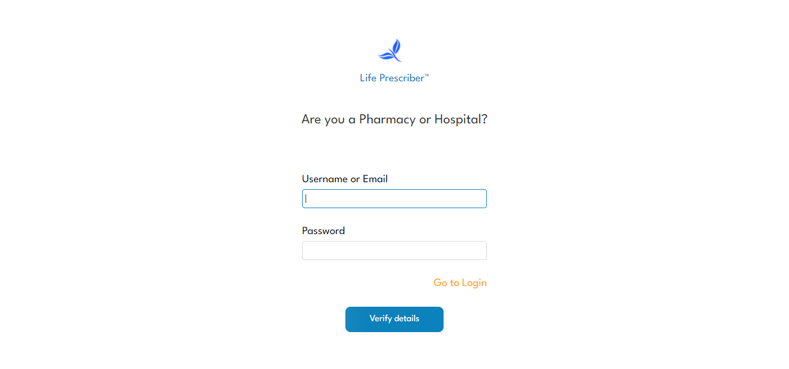

- Verify Login Information:
   Enter login credentials provided by system admin at onboarding and click "verify details"
   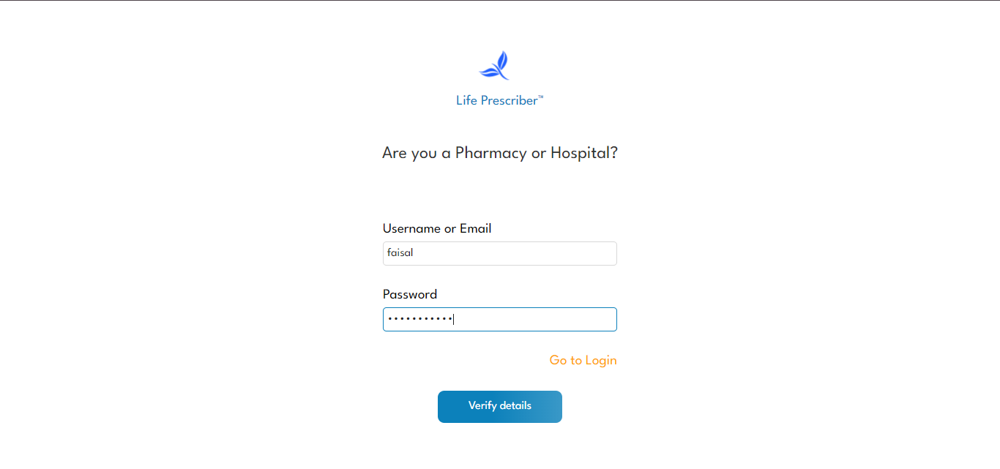

   On successful verification, you can now navigate to either the "Hospital Portal" or "Phamarcy Portal" depending on your role on the system. 
   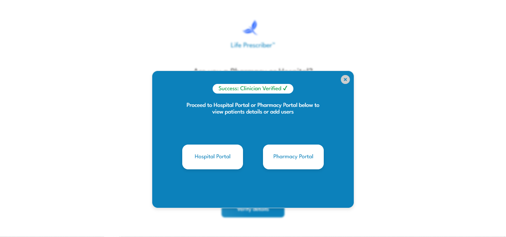

- Hospital Portal:
   In the hospital portal, you can onboard new patient(s) to the platform by clicking "Register" and filling in required information or use "Search" to query the platform using a patient's 'Insurance Provider Name' and 'Insurance ID Number'.
   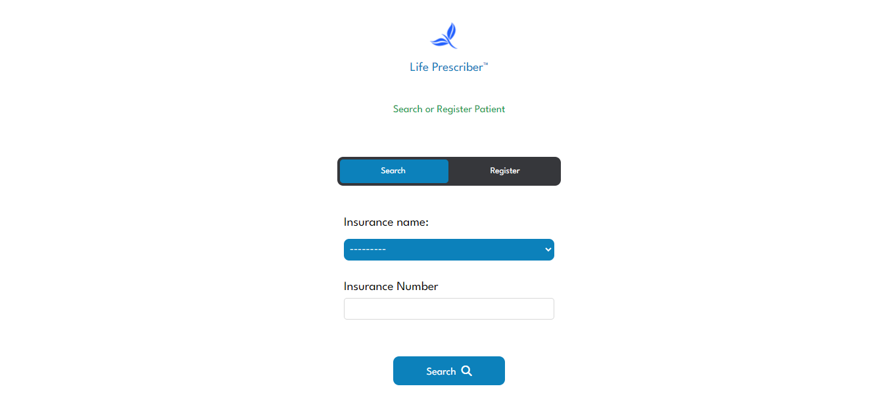

   Enter required information
   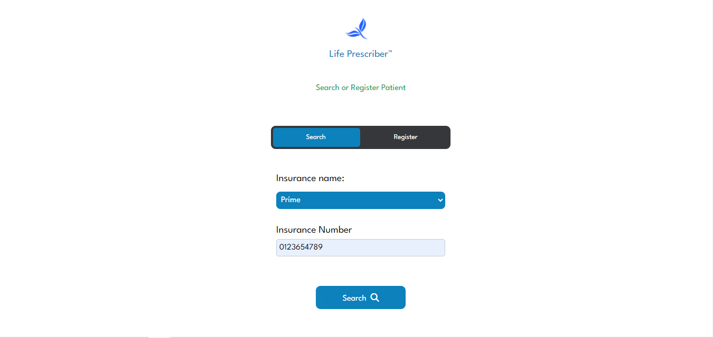

   Displays Response Message
   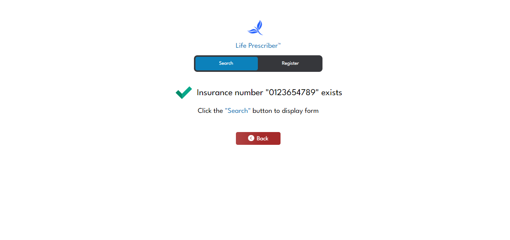

- Pharmacy Portal:
   In the pharmacy portal, new pharmacy staff(s) can onboarded or deleted.
   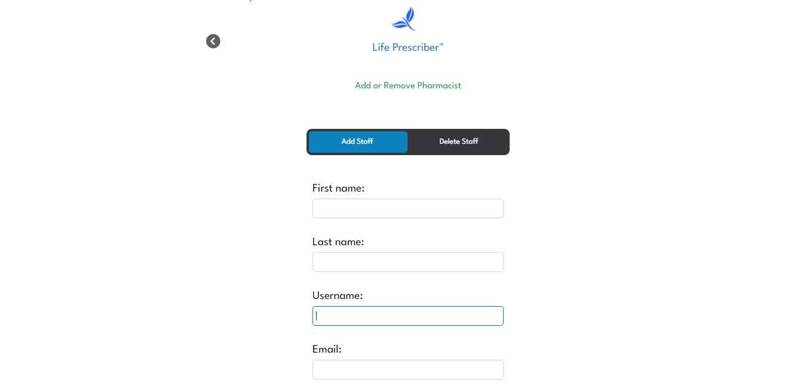
   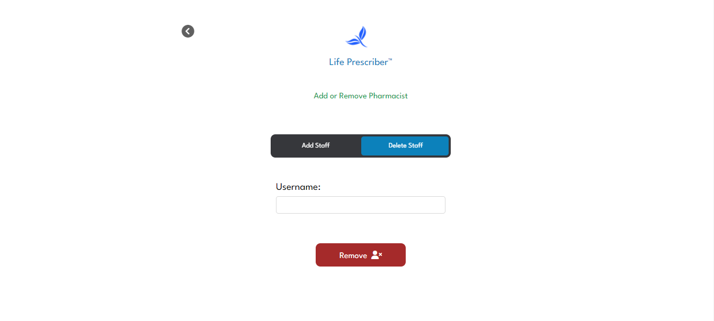

- Login into Life Prescriber Clinician Dashboard:
   To access patient's medical information securely stored on the database for creating, modifying and/or tracking prescriptions, clinicians can navigate to the login interface by clicking "Go to Login" from "[General Homepage Login](https://turingmachines.pythonanywhere.com/prescription_ongo/general_home/)" and providing their credentials.
   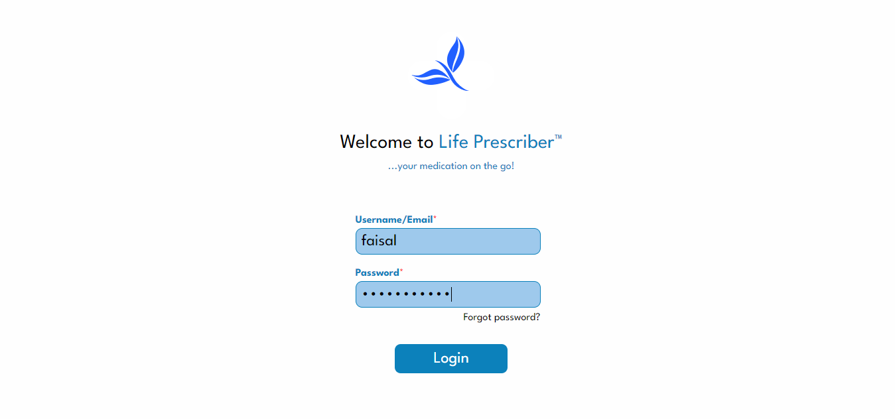

   Clinician(s) enters patient's credentials (Insurance Name and Insurance ID No.) to search for patient's prescritption information in the database.
   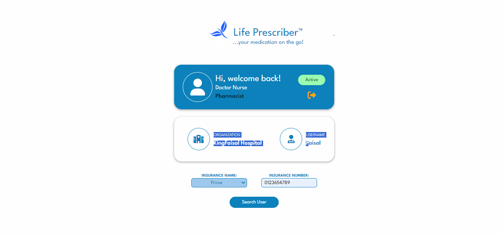

   Search returns patient's information if found.
   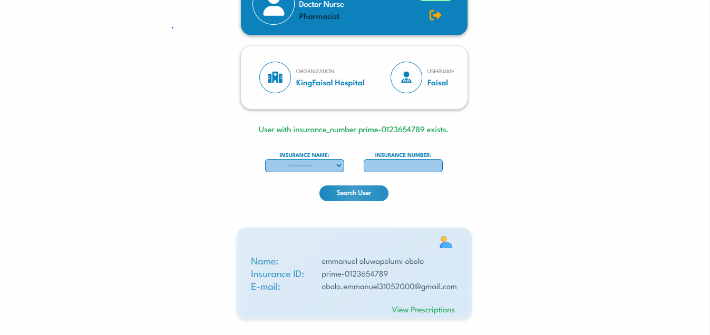

   Clinician(s) can click on "View Prescription" to see patient's prescription details. This displays every prescription the patient has received since onboarding into Life Prescriber. This page shows detailed information on each prescription (Drug name, Datetime of prescription, Time of first dose, Notification time, End date, Total no. tablets, Amount of tablets per dose, Remaining tablets, Dosage per day)
   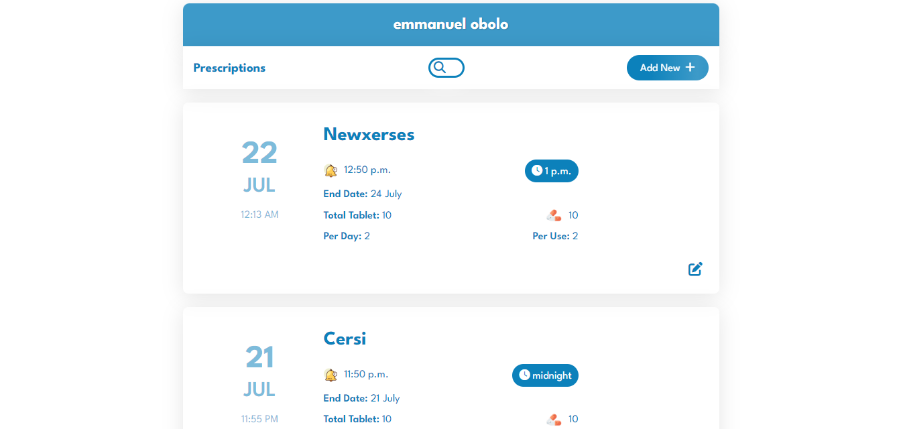

   Clinician(s) can add new prescription by clicking the "Add New".
   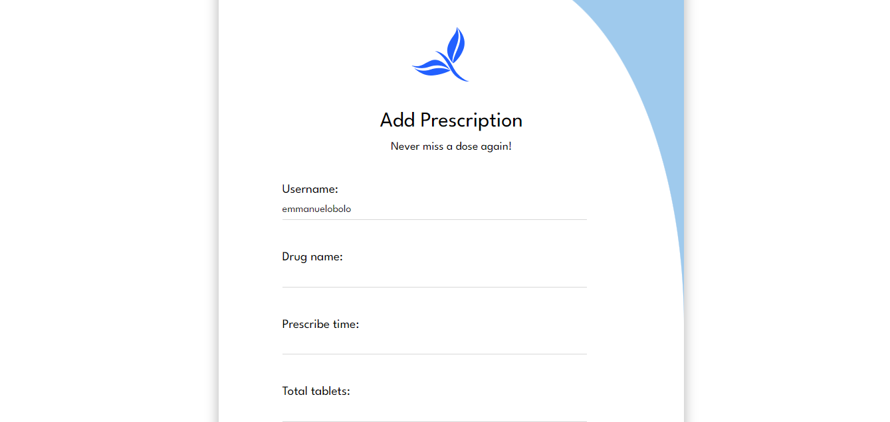

   Clinician(s) can also click the edit button to make changes to prescriptions where necessary.
   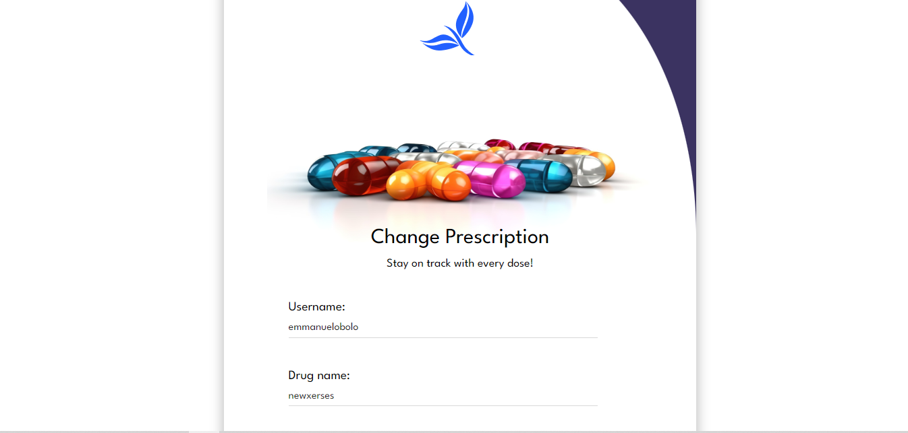


## Installation

### Prerequisites

- Python 3.10+
- Redis (for Celery) watch video [Redis installation](https://www.youtube.com/watch?v=DLKzd3bvgt8&t=197s)

### Setup

1. *Create and activate a virtual environment:*
   bash
   ```
   python -m venv your_virtual_environment_name
   source venv/bin/activate   # On Windows use `your_virtual_environment_name\Scripts\activate`
   ```

2. *Clone the repository:*
   bash
   ```
   git clone https://github.com/olugbeminiyi2000/MedHack_Life_Prescriber.git
   cd MedHack_Life_Prescriber/
   ```

3. *Install dependencies:*
   bash
   ```
   pip install -r requirements.txt
   ```
   

4. *Set up the Django project:*
   bash
   ```
   cd Life_Prescriber
   python manage.py makemigrations
   python manage.py migrate
   python manage.py createsuperuser --email=your_email --username=your_username
   python manage.py check
   python manage.py runserver
   ```

   

5. *Set up Celery:*
   - open up 2 command line interface at vscode terminal Launch Profile.
   - then change directory to MedHack_Life_Prescriber/Life_Prescriber/ if not there.
   bash
   ```
   celery -A Life_Prescriber worker --pool=solo -l INFO
   celery -A Life_Prescriber beat -l INFO
   ```

## Usage

- Log in to the admin panel at http://127.0.0.1:8000/admin/ using your superuser credentials.
- Onboard patients and manage prescriptions.
- Track patient medication adherence through the backend system.

## Configuration

### Celery Configuration

In Life_Prescriber/celery.py:
python
```
app.conf.beat_schedule = {
    'task-name': {
        'task': 'prescription_ongo.tasks.send_async_email',
        'schedule': crontab(minute='*/10'),
    },
}
# very important do not change
app.conf.task_default_queue = 'default'
```

## License

This project is licensed under the MIT License. See the [LICENSE](LICENSE) file for details.

---

### Additional Included Files

1. *LICENSE*: The licensing information for the project.
2. *requirements.txt*: List of dependencies required to run the project.
3. *.gitignore*: Specifies files and directories to be ignored by Git.